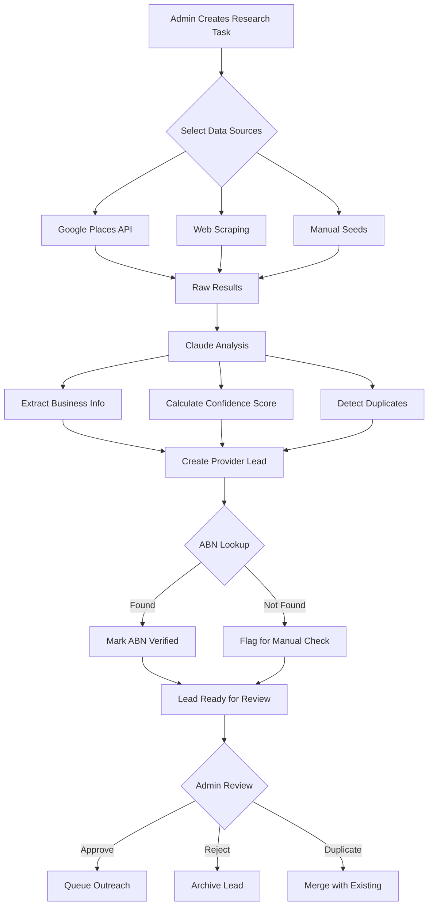
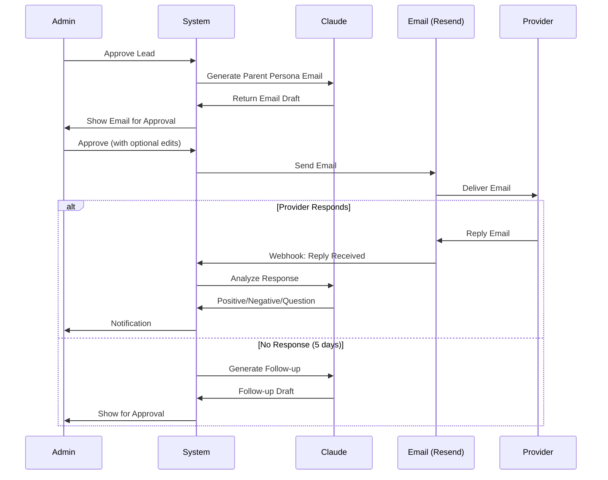
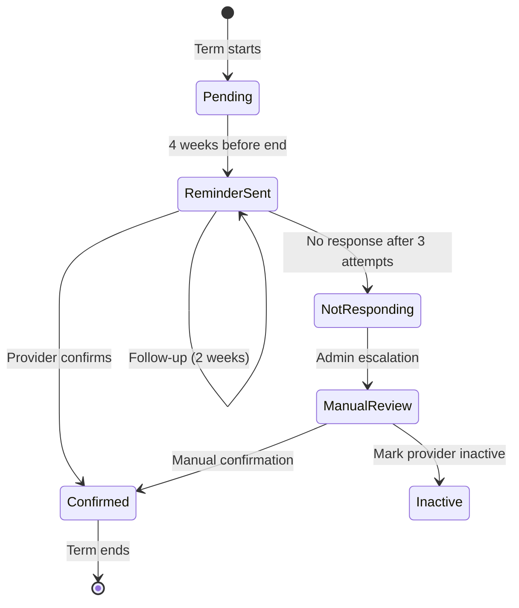

# Agentic Provider Research System - Journey Maps

> **Related**: [Agent System Architecture](./agent-system.md) | [PRD Epic 5](/docs/reference/prd.md#epic-5-agentic-provider-discovery-p0)

## Overview

This document visualizes the workflows, user journeys, and system interactions for the autonomous provider discovery and onboarding system.

---

## 1. High-Level System Flow

```
┌─────────────────────────────────────────────────────────────────────────────────┐
│                           AGENTIC PROVIDER SYSTEM                                │
├─────────────────────────────────────────────────────────────────────────────────┤
│                                                                                  │
│   ┌──────────┐    ┌──────────┐    ┌──────────┐    ┌──────────┐    ┌──────────┐ │
│   │ RESEARCH │───▶│  REVIEW  │───▶│ OUTREACH │───▶│  VERIFY  │───▶│ ONBOARD  │ │
│   │          │    │          │    │          │    │          │    │          │ │
│   │ Discover │    │  Admin   │    │ Transparent│   │   ABN    │    │ Convert  │ │
│   │ Providers│    │ Approves │    │  Email    │    │  + Docs  │    │ to Live  │ │
│   └──────────┘    └──────────┘    └──────────┘    └──────────┘    └──────────┘ │
│        │               │               │               │               │        │
│        ▼               ▼               ▼               ▼               ▼        │
│   ┌──────────┐    ┌──────────┐    ┌──────────┐    ┌──────────┐    ┌──────────┐ │
│   │  Agent   │    │  Human   │    │  Agent   │    │  Agent   │    │  Human   │ │
│   │  + LLM   │    │ Decision │    │  + LLM   │    │  + APIs  │    │ Decision │ │
│   └──────────┘    └──────────┘    └──────────┘    └──────────┘    └──────────┘ │
│                                                                                  │
│  OUTREACH APPROACH: Transparent "Parent + Platform" hybrid                       │
│  "Hi, I'm [Name], parent & founder of Parent Pilot. I'd love to feature your    │
│   programs and help local families discover you..."                              │
│                                                                                  │
└─────────────────────────────────────────────────────────────────────────────────┘
```

---

## 2. Admin Journey Map

### Creating a Research Task

```
┌─────────────────────────────────────────────────────────────────────────────────┐
│                         ADMIN: INITIATE PROVIDER RESEARCH                        │
├─────────────────────────────────────────────────────────────────────────────────┤
│                                                                                  │
│  TOUCHPOINT        ACTION                      SYSTEM RESPONSE                   │
│  ──────────        ──────                      ───────────────                   │
│                                                                                  │
│  Dashboard    ──▶  Click "New Research"   ──▶  Opens research form              │
│      │                                                                           │
│      ▼                                                                           │
│  Research     ──▶  Select region (NSW)    ──▶  Shows region stats               │
│  Form              Select sources               Estimates lead count             │
│      │             - Google Places                                               │
│      │             - Web Search                                                  │
│      │             - Manual Seeds                                                │
│      ▼                                                                           │
│  Submit       ──▶  Click "Start Research" ──▶  Creates ResearchTask             │
│                                                 Queues RESEARCH jobs             │
│      │                                          Shows "Processing..."            │
│      ▼                                                                           │
│  Monitor      ──▶  View progress bar      ──▶  Real-time lead count             │
│                    Check back later             Email when complete              │
│                                                                                  │
│  ════════════════════════════════════════════════════════════════════════════   │
│  EMOTIONS:   Curious ──▶ Anticipating ──▶ Confident ──▶ Satisfied               │
│  ════════════════════════════════════════════════════════════════════════════   │
│                                                                                  │
└─────────────────────────────────────────────────────────────────────────────────┘
```

### Reviewing Discovered Leads

```
┌─────────────────────────────────────────────────────────────────────────────────┐
│                           ADMIN: REVIEW PROVIDER LEADS                           │
├─────────────────────────────────────────────────────────────────────────────────┤
│                                                                                  │
│  ┌─────────────────────────────────────────────────────────────────────────┐    │
│  │                         LEAD REVIEW QUEUE                                │    │
│  │  ┌─────────────────────────────────────────────────────────────────┐    │    │
│  │  │  ★★★★☆  Sydney Kids Camp              NSW    85% confidence     │    │    │
│  │  │  ──────────────────────────────────────────────────────────────  │    │    │
│  │  │  📍 Parramatta  📧 info@sydkidscamp.com.au  🔗 Website          │    │    │
│  │  │  🏢 ABN: 12 345 678 901 (Verified ✓)                            │    │    │
│  │  │                                                                   │    │    │
│  │  │  AI Summary: "Established holiday care provider operating        │    │    │
│  │  │  since 2015. Offers STEM, sports, and arts programs for         │    │    │
│  │  │  ages 5-12. Located in Western Sydney with good reviews."       │    │    │
│  │  │                                                                   │    │    │
│  │  │  [✓ Approve]  [✗ Reject]  [⚠ Flag Duplicate]  [📝 Edit]         │    │    │
│  │  └─────────────────────────────────────────────────────────────────┘    │    │
│  │                                                                          │    │
│  │  ┌─────────────────────────────────────────────────────────────────┐    │    │
│  │  │  ★★★☆☆  Fun Times Activities          VIC    62% confidence     │    │    │
│  │  │  ──────────────────────────────────────────────────────────────  │    │    │
│  │  │  📍 Melbourne  📧 ???  🔗 Facebook only                         │    │    │
│  │  │  🏢 ABN: Not found                                               │    │    │
│  │  │                                                                   │    │    │
│  │  │  AI Summary: "Small operator found on Facebook. Limited info    │    │    │
│  │  │  available. May need manual verification of business status."   │    │    │
│  │  │                                                                   │    │    │
│  │  │  [✓ Approve]  [✗ Reject]  [⚠ Flag Duplicate]  [📝 Edit]         │    │    │
│  │  └─────────────────────────────────────────────────────────────────┘    │    │
│  └─────────────────────────────────────────────────────────────────────────┘    │
│                                                                                  │
│  DECISION FACTORS:                                                               │
│  ┌────────────────┬────────────────┬────────────────┬────────────────┐          │
│  │ ✓ High         │ ✓ ABN Verified │ ✓ Website      │ ✓ Contact Info │          │
│  │   Confidence   │                │   Available    │   Complete     │          │
│  └────────────────┴────────────────┴────────────────┴────────────────┘          │
│                                                                                  │
└─────────────────────────────────────────────────────────────────────────────────┘
```

### Approving Outreach Emails

```
┌─────────────────────────────────────────────────────────────────────────────────┐
│                         ADMIN: APPROVE OUTREACH EMAIL                            │
├─────────────────────────────────────────────────────────────────────────────────┤
│                                                                                  │
│  ┌─────────────────────────────────────────────────────────────────────────┐    │
│  │  EMAIL PREVIEW                                              [Edit] [Send]│    │
│  │  ───────────────────────────────────────────────────────────────────────│    │
│  │                                                                          │    │
│  │  To: info@sydkidscamp.com.au                                            │    │
│  │  From: hello@holidayhero.com.au (Platform - Parent Founder)             │    │
│  │  Subject: Feature Sydney Kids Camp on Parent Pilot?                     │    │
│  │                                                                          │    │
│  │  ┌────────────────────────────────────────────────────────────────┐     │    │
│  │  │                                                                 │     │    │
│  │  │  Hi there,                                                      │     │    │
│  │  │                                                                 │     │    │
│  │  │  I'm Sarah, a mum of two and the founder of Parent Pilot -     │     │    │
│  │  │  a platform helping parents in Sydney discover great holiday   │     │    │
│  │  │  programs for their kids.                                       │     │    │
│  │  │                                                                 │     │    │
│  │  │  I came across Sydney Kids Camp while researching programs in  │     │    │
│  │  │  Parramatta and your STEM activities look fantastic! I'd love  │     │    │
│  │  │  to feature your programs on our platform.                      │     │    │
│  │  │                                                                 │     │    │
│  │  │  Here's what we offer providers (completely free):              │     │    │
│  │  │  • Exposure to hundreds of local parents searching for programs │     │    │
│  │  │  • A professional listing that showcases your programs          │     │    │
│  │  │  • Less time on marketing, more parents finding you             │     │    │
│  │  │                                                                 │     │    │
│  │  │  Would you be interested in being listed? I'd just need your   │     │    │
│  │  │  program schedule and a few details.                            │     │    │
│  │  │                                                                 │     │    │
│  │  │  Cheers,                                                        │     │    │
│  │  │  Sarah                                                          │     │    │
│  │  │  Founder, Parent Pilot                                          │     │    │
│  │  │                                                                 │     │    │
│  │  └────────────────────────────────────────────────────────────────┘     │    │
│  │                                                                          │    │
│  │  ⚡ Generated by Claude  │  Tokens: 412  │  Est. cost: $0.01           │    │
│  │                                                                          │    │
│  │  [✓ Approve & Send]  [✏️ Edit Email]  [🔄 Regenerate]  [✗ Cancel]       │    │
│  └─────────────────────────────────────────────────────────────────────────┘    │
│                                                                                  │
└─────────────────────────────────────────────────────────────────────────────────┘
```

---

## 3. Provider Journey Map

### From Discovery to Onboarding

```
┌─────────────────────────────────────────────────────────────────────────────────┐
│                      PROVIDER JOURNEY: DISCOVERY TO LISTING                      │
├─────────────────────────────────────────────────────────────────────────────────┤
│                                                                                  │
│  STAGE 1: UNAWARE                                                                │
│  ════════════════                                                                │
│  Provider exists but doesn't know about Parent Pilot platform                    │
│                                                                                  │
│       [Provider Website]  ◄──── Agent discovers via Google Places               │
│              │                                                                   │
│              ▼                                                                   │
│  ┌─────────────────────────────────────────────────────────────────────────┐    │
│  │  🤖 AGENT RESEARCHES                                                     │    │
│  │  • Scrapes website for program info                                      │    │
│  │  • Looks up ABN for verification                                         │    │
│  │  • Claude summarizes business profile                                    │    │
│  │  • Admin approves as quality lead                                        │    │
│  └─────────────────────────────────────────────────────────────────────────┘    │
│              │                                                                   │
│              ▼                                                                   │
│  STAGE 2: FIRST CONTACT (Transparent Outreach)                                   │
│  ═════════════════════════════════════════════                                   │
│  Provider receives friendly email from Parent Pilot founder                      │
│                                                                                  │
│       ┌─────────────────────────────────────────────┐                           │
│       │  📧 Email arrives                           │                           │
│       │  "Hi! I'm Sarah, parent & founder of        │                           │
│       │   Parent Pilot. I'd love to feature your    │                           │
│       │   programs on our platform..."              │                           │
│       │                                              │                           │
│       │  📎 Includes: Value props, what we offer    │                           │
│       │                                              │                           │
│       │  Provider thinks: "A listing opportunity!"  │                           │
│       └─────────────────────────────────────────────┘                           │
│              │                                                                   │
│              ├──── No response ────▶ Follow-up in 5 days                        │
│              │                                                                   │
│              ▼                                                                   │
│  STAGE 3: ENGAGEMENT                                                             │
│  ═══════════════════                                                             │
│  Provider responds with interest                                                 │
│                                                                                  │
│       ┌─────────────────────────────────────────────┐                           │
│       │  📧 Provider replies                        │                           │
│       │  "Hi Sarah! Yes, we'd love to be listed.    │                           │
│       │   Here's our program info..."               │                           │
│       │                                              │                           │
│       │  🤖 Agent detects positive response         │                           │
│       │  Admin reviews and triggers verification    │                           │
│       └─────────────────────────────────────────────┘                           │
│              │                                                                   │
│              ▼                                                                   │
│  STAGE 4: VERIFICATION                                                           │
│  ═════════════════════                                                           │
│  Provider submits required documentation                                         │
│                                                                                  │
│       ┌─────────────────────────────────────────────┐                           │
│       │  📋 Verification checklist                  │                           │
│       │  ☑ ABN verified automatically               │                           │
│       │  ☐ Working With Children Check              │                           │
│       │  ☐ Public Liability Insurance               │                           │
│       │  ☐ Program details confirmed                │                           │
│       └─────────────────────────────────────────────┘                           │
│              │                                                                   │
│              ▼                                                                   │
│  STAGE 5: LIVE LISTING                                                           │
│  ═════════════════════                                                           │
│  Provider converted to full platform listing                                     │
│                                                                                  │
│       ┌─────────────────────────────────────────────┐                           │
│       │  ✅ PROVIDER ONBOARDED                      │                           │
│       │  • Listed on Parent Pilot                   │                           │
│       │  • Programs visible to parents              │                           │
│       │  • Receives term confirmation reminders     │                           │
│       └─────────────────────────────────────────────┘                           │
│                                                                                  │
└─────────────────────────────────────────────────────────────────────────────────┘
```

---

## 4. Term Confirmation Cycle

```
┌─────────────────────────────────────────────────────────────────────────────────┐
│                         TERM CONFIRMATION LIFECYCLE                              │
├─────────────────────────────────────────────────────────────────────────────────┤
│                                                                                  │
│                            SCHOOL YEAR CYCLE                                     │
│                                                                                  │
│     TERM 1              TERM 2              TERM 3              TERM 4          │
│   Jan - Apr           Apr - Jul           Jul - Sep           Oct - Dec         │
│       │                   │                   │                   │             │
│       ▼                   ▼                   ▼                   ▼             │
│   ┌───────┐           ┌───────┐           ┌───────┐           ┌───────┐        │
│   │CONFIRM│           │CONFIRM│           │CONFIRM│           │CONFIRM│        │
│   │ CYCLE │           │ CYCLE │           │ CYCLE │           │ CYCLE │        │
│   └───────┘           └───────┘           └───────┘           └───────┘        │
│                                                                                  │
│  ════════════════════════════════════════════════════════════════════════════   │
│                                                                                  │
│                    SINGLE TERM CONFIRMATION CYCLE                                │
│                                                                                  │
│   4 WEEKS BEFORE          2 WEEKS BEFORE          1 WEEK BEFORE                 │
│   TERM ENDS               TERM ENDS               TERM ENDS                     │
│        │                       │                       │                        │
│        ▼                       ▼                       ▼                        │
│   ┌─────────┐             ┌─────────┐             ┌─────────┐                   │
│   │ Initial │             │Follow-up│             │  Final  │                   │
│   │Reminder │────────────▶│Reminder │────────────▶│ Warning │                   │
│   └─────────┘             └─────────┘             └─────────┘                   │
│        │                       │                       │                        │
│        ▼                       ▼                       ▼                        │
│   ┌─────────────────────────────────────────────────────────────────────────┐   │
│   │                     PROVIDER RESPONSE OPTIONS                            │   │
│   │                                                                          │   │
│   │   ┌─────────────┐    ┌─────────────┐    ┌─────────────────────────────┐ │   │
│   │   │   PORTAL    │    │   EMAIL     │    │        NO RESPONSE          │ │   │
│   │   │   CONFIRM   │    │   REPLY     │    │                             │ │   │
│   │   │             │    │             │    │  After 3 attempts:          │ │   │
│   │   │ Click link, │    │ Reply with  │    │  • Flag for manual review   │ │   │
│   │   │ confirm     │    │ "Yes, we're │    │  • Consider marking         │ │   │
│   │   │ programs    │    │ running     │    │    as inactive              │ │   │
│   │   │             │    │ programs"   │    │                             │ │   │
│   │   └──────┬──────┘    └──────┬──────┘    └─────────────┬───────────────┘ │   │
│   │          │                  │                         │                  │   │
│   │          ▼                  ▼                         ▼                  │   │
│   │   ┌─────────────────────────────────────────────────────────────────┐   │   │
│   │   │                    OUTCOME                                       │   │   │
│   │   │                                                                  │   │   │
│   │   │  ✅ CONFIRMED          ✅ CONFIRMED           ⚠️ NEEDS REVIEW    │   │   │
│   │   │  Programs updated      Status updated         Admin escalation   │   │   │
│   │   │                                                                  │   │   │
│   │   └─────────────────────────────────────────────────────────────────┘   │   │
│   └─────────────────────────────────────────────────────────────────────────┘   │
│                                                                                  │
└─────────────────────────────────────────────────────────────────────────────────┘
```

---

## 5. Email Sequence Timeline

```
┌─────────────────────────────────────────────────────────────────────────────────┐
│                          OUTREACH EMAIL SEQUENCE                                 │
├─────────────────────────────────────────────────────────────────────────────────┤
│                                                                                  │
│  DAY 0          DAY 5          DAY 12         DAY 20         DAY 30             │
│    │              │              │              │              │                │
│    ▼              ▼              ▼              ▼              ▼                │
│ ┌──────┐      ┌──────┐      ┌──────┐      ┌──────┐      ┌──────┐              │
│ │INIT  │      │FOLLOW│      │FOLLOW│      │REVEAL│      │CLOSE │              │
│ │EMAIL │─────▶│UP #1 │─────▶│UP #2 │─────▶│PLATFM│─────▶│ OUT  │              │
│ └──────┘      └──────┘      └──────┘      └──────┘      └──────┘              │
│    │              │              │              │              │                │
│    │              │              │              │              │                │
│ ┌──┴──┐       ┌──┴──┐       ┌──┴──┐       ┌──┴──┐       ┌──┴──┐              │
│ │Reply│       │Reply│       │Reply│       │Reply│       │ No  │              │
│ │ ?   │       │ ?   │       │ ?   │       │ ?   │       │Reply│              │
│ └──┬──┘       └──┬──┘       └──┬──┘       └──┬──┘       └──┬──┘              │
│    │              │              │              │              │                │
│    YES ──────────────────────────────────────────▶ VERIFICATION PHASE          │
│                                                                                  │
│                                                        NO ──▶ MARK INACTIVE     │
│                                                                                  │
│  ════════════════════════════════════════════════════════════════════════════   │
│                                                                                  │
│  EMAIL CONTENT BY STAGE:                                                         │
│                                                                                  │
│  ┌────────────┬───────────────────────────────────────────────────────────────┐ │
│  │ Stage      │ Content & Tone                                                │ │
│  ├────────────┼───────────────────────────────────────────────────────────────┤ │
│  │ INITIAL    │ "Hi! I'm [Name], parent & founder of Parent Pilot. I'd love  │ │
│  │            │ to feature your programs on our platform..."                  │ │
│  │            │ Transparent, value-focused, personal touch                    │ │
│  ├────────────┼───────────────────────────────────────────────────────────────┤ │
│  │ FOLLOW #1  │ "Just following up on my email about featuring [Business]    │ │
│  │            │ on Parent Pilot..."  Brief, friendly, reiterates value        │ │
│  ├────────────┼───────────────────────────────────────────────────────────────┤ │
│  │ FOLLOW #2  │ "Last check-in - we'd still love to help parents discover    │ │
│  │            │ your programs..."  Final attempt, leaves door open            │ │
│  ├────────────┼───────────────────────────────────────────────────────────────┤ │
│  │ CLOSE OUT  │ (No email - internal action only)                             │ │
│  │            │ Mark lead as unresponsive, archive                            │ │
│  └────────────┴───────────────────────────────────────────────────────────────┘ │
│                                                                                  │
└─────────────────────────────────────────────────────────────────────────────────┘
```

---

## 6. System State Diagram

```
┌─────────────────────────────────────────────────────────────────────────────────┐
│                            LEAD STATE MACHINE                                    │
├─────────────────────────────────────────────────────────────────────────────────┤
│                                                                                  │
│                              ┌─────────────┐                                    │
│                              │   CREATED   │                                    │
│                              │  (by agent) │                                    │
│                              └──────┬──────┘                                    │
│                                     │                                           │
│                                     ▼                                           │
│                         ┌─────────────────────┐                                 │
│                         │   PENDING_REVIEW    │◄────────────────┐               │
│                         │                     │                  │               │
│                         │  Awaiting admin     │    Edit & Resubmit              │
│                         │  approval           │                  │               │
│                         └──────────┬──────────┘                  │               │
│                                    │                             │               │
│                    ┌───────────────┼───────────────┐             │               │
│                    │               │               │             │               │
│                    ▼               ▼               ▼             │               │
│             ┌──────────┐    ┌──────────┐    ┌──────────┐        │               │
│             │ APPROVED │    │ REJECTED │    │DUPLICATE │        │               │
│             │          │    │          │    │          │        │               │
│             │ Ready for│    │ Not      │    │ Already  │        │               │
│             │ outreach │    │ suitable │    │ exists   │        │               │
│             └────┬─────┘    └──────────┘    └──────────┘        │               │
│                  │                 │               │             │               │
│                  │                 └───────────────┴─────────────┘               │
│                  │                       (Can be reopened)                       │
│                  ▼                                                               │
│         ┌───────────────┐                                                       │
│         │   OUTREACH    │                                                       │
│         │   IN_PROGRESS │◄─────────────────────────────┐                        │
│         │               │                               │                        │
│         │ Emails being  │       Follow-up scheduled    │                        │
│         │ sent          │                               │                        │
│         └───────┬───────┘                               │                        │
│                 │                                       │                        │
│      ┌──────────┼──────────┐                           │                        │
│      │          │          │                           │                        │
│      ▼          ▼          ▼                           │                        │
│ ┌─────────┐ ┌────────┐ ┌──────────┐                   │                        │
│ │RESPONDED│ │NO_REPLY│ │ BOUNCED  │                   │                        │
│ │         │ │        │ │          │                   │                        │
│ │ Got a   │ │ Max    │ │ Invalid  │                   │                        │
│ │ reply!  │ │ follow │ │ email    │───────────────────┘                        │
│ │         │ │ ups    │ │          │   (Try alternate email)                    │
│ └────┬────┘ └───┬────┘ └──────────┘                                            │
│      │          │                                                               │
│      │          ▼                                                               │
│      │    ┌──────────┐                                                          │
│      │    │ INACTIVE │                                                          │
│      │    │          │                                                          │
│      │    │ Archived │                                                          │
│      │    └──────────┘                                                          │
│      │                                                                          │
│      ▼                                                                          │
│ ┌────────────┐                                                                  │
│ │VERIFICATION│                                                                  │
│ │IN_PROGRESS │                                                                  │
│ │            │                                                                  │
│ │ Checking   │                                                                  │
│ │ ABN, docs  │                                                                  │
│ └─────┬──────┘                                                                  │
│       │                                                                         │
│       ▼                                                                         │
│ ┌──────────┐                                                                    │
│ │CONVERTED │                                                                    │
│ │          │                                                                    │
│ │ Now a    │─────────▶  Full Provider record created                           │
│ │ Provider │            Listed on platform                                      │
│ │          │            Term confirmations enabled                              │
│ └──────────┘                                                                    │
│                                                                                  │
└─────────────────────────────────────────────────────────────────────────────────┘
```

---

## 7. Metrics & KPIs Dashboard

```
┌─────────────────────────────────────────────────────────────────────────────────┐
│                          AGENT PERFORMANCE DASHBOARD                             │
├─────────────────────────────────────────────────────────────────────────────────┤
│                                                                                  │
│  ┌─────────────────┐  ┌─────────────────┐  ┌─────────────────┐  ┌─────────────┐│
│  │   RESEARCH      │  │    OUTREACH     │  │   CONVERSION    │  │    COST     ││
│  │   ───────────   │  │   ───────────   │  │   ───────────   │  │  ─────────  ││
│  │                 │  │                 │  │                 │  │             ││
│  │  Leads Found    │  │  Emails Sent    │  │  Leads to       │  │  LLM Spend  ││
│  │     247         │  │     183         │  │  Providers      │  │   $42.50    ││
│  │   this month    │  │   this month    │  │    12.3%        │  │  this month ││
│  │                 │  │                 │  │                 │  │             ││
│  └─────────────────┘  └─────────────────┘  └─────────────────┘  └─────────────┘│
│                                                                                  │
│  ════════════════════════════════════════════════════════════════════════════   │
│                                                                                  │
│  FUNNEL VISUALIZATION                                                            │
│                                                                                  │
│  ┌───────────────────────────────────────────────────────────────┐              │
│  │████████████████████████████████████████████████████████████████│ 247 Leads   │
│  └───────────────────────────────────────────────────────────────┘ Discovered   │
│                                                                                  │
│       ┌────────────────────────────────────────────────────┐                    │
│       │███████████████████████████████████████████████████ │ 198 Approved      │
│       └────────────────────────────────────────────────────┘ (80%)              │
│                                                                                  │
│            ┌─────────────────────────────────────────┐                          │
│            │████████████████████████████████████████ │ 143 Responded           │
│            └─────────────────────────────────────────┘ (72%)                    │
│                                                                                  │
│                   ┌────────────────────────────┐                                │
│                   │███████████████████████████ │ 67 Interested                 │
│                   └────────────────────────────┘ (47%)                          │
│                                                                                  │
│                          ┌───────────────┐                                      │
│                          │██████████████ │ 31 Converted                        │
│                          └───────────────┘ (46%)                                │
│                                                                                  │
│  ════════════════════════════════════════════════════════════════════════════   │
│                                                                                  │
│  RESPONSE RATE BY EMAIL TYPE                                                     │
│                                                                                  │
│  Initial Email    ████████████████████████████░░░░░░░░░░░░░  58%                │
│  Follow-up #1     ████████████████░░░░░░░░░░░░░░░░░░░░░░░░░  32%                │
│  Follow-up #2     ████████░░░░░░░░░░░░░░░░░░░░░░░░░░░░░░░░░  18%                │
│  Platform Reveal  ██████████████████████████████░░░░░░░░░░░  62%                │
│                                                                                  │
│  ════════════════════════════════════════════════════════════════════════════   │
│                                                                                  │
│  TERM CONFIRMATION STATUS (Current Term)                                         │
│                                                                                  │
│  ┌─────────────┬─────────────┬─────────────┬─────────────┬─────────────┐        │
│  │   Pending   │    Sent     │  Confirmed  │ No Response │  Inactive   │        │
│  │     23      │     45      │     89      │      12     │      6      │        │
│  │             │             │             │             │             │        │
│  │    ⏳       │    📧       │     ✅      │     ⚠️      │     ❌      │        │
│  └─────────────┴─────────────┴─────────────┴─────────────┴─────────────┘        │
│                                                                                  │
└─────────────────────────────────────────────────────────────────────────────────┘
```

---

## 8. Mermaid Diagrams (for GitHub rendering)

### Research Flow



### Outreach Flow



### Term Confirmation Flow



---

## Related Documents

- [Implementation Plan](/.claude/plans/sorted-wondering-plum.md)
- [Phase 1 Issues](#230, #231, #232, #233)
- [Tech Stack](/docs/architecture/tech-stack.md)
- [Provider Model](/docs/architecture/data-models.md)
