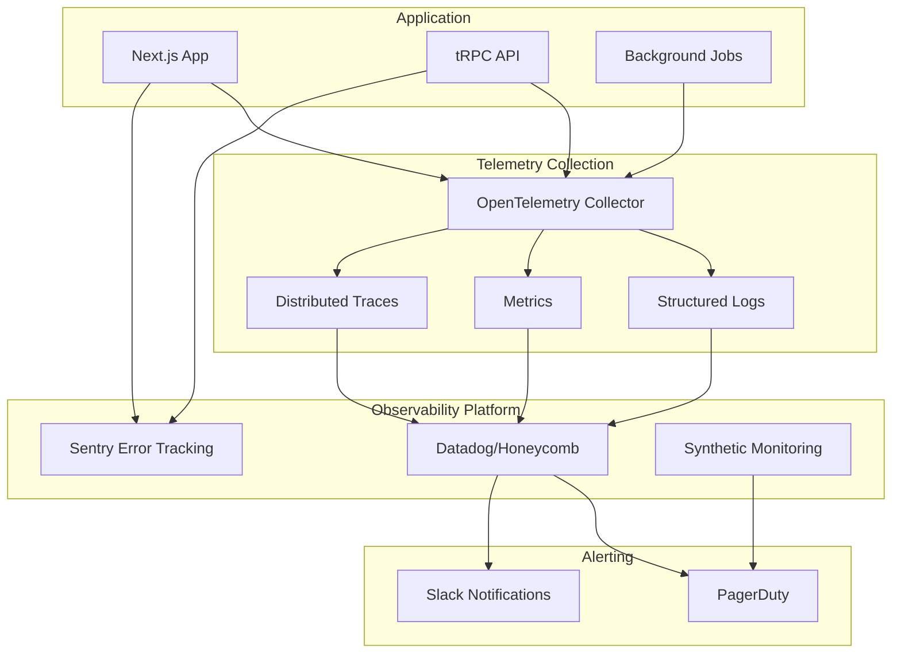

# **High Level Architecture**

* **Technical Summary:** The architecture will be a modern, full-stack, serverless web application built on the T3 Stack. It leverages Next.js for the frontend and tRPC for a type-safe API layer, housed within a Turborepo monorepo. The system will be deployed on Vercel for seamless integration and scalability, with a PostgreSQL database managed by a service like Supabase or Neon.
* **Platform and Infrastructure Choice:**
    * **Platform:** **Vercel**.
    * **Key Services:** Vercel Serverless Functions, Vercel Edge Network, and a managed PostgreSQL provider (e.g., Supabase, Neon).
    * **Regions:** Database hosted in **ap-southeast-2 (Sydney)**.
* **Repository Structure:**
    * **Structure:** **Monorepo**.
    * **Tool:** **Turborepo**.
* **High Level Architecture Diagram:**
    ```mermaid
    graph TD
        subgraph User Browser
            U[Parent User]
        end

        subgraph Vercel Platform
            V_CDN[Edge Network / CDN]
            V_FE[Next.js Frontend]
            V_API[Serverless Functions <br> (tRPC API)]
        end

        subgraph Third-Party Services
            DB[(PostgreSQL Database <br> e.g., Supabase/Neon)]
            Stripe[Stripe Payments]
            Email[Email Service <br> e.g., SendGrid]
        end
        
        U --> V_CDN;
        V_CDN --> V_FE;
        V_FE --> V_API;
        V_API --> DB;
        V_API --> Stripe;
        V_API --> Email;
    ```
* **Architectural Patterns:** Jamstack Architecture, Serverless Functions, Repository Pattern (with Prisma), and API Gateway Pattern (implicit via Next.js/Vercel).

## **Observability & Security Architecture**

### **Security Layers**
1. **Edge Security:** Cloudflare WAF and DDoS protection
2. **Application Security:** Security headers, CSP, rate limiting
3. **Authentication:** NextAuth.js with secure session management
4. **Data Security:** Field-level encryption for PII, TLS 1.3 everywhere

### **Observability Stack**


### **Key Observability Components**
1. **Distributed Tracing:** Full request lifecycle visibility across frontend and backend
2. **Structured Logging:** JSON logs with correlation IDs for request tracking
3. **Metrics Collection:** Business and technical metrics with configurable dashboards
4. **Error Tracking:** Automatic error capture with PII scrubbing
5. **Synthetic Monitoring:** Continuous testing of critical user journeys
6. **Real User Monitoring (RUM):** Frontend performance metrics from actual users

### **Security Monitoring**
1. **Audit Logging:** All authentication and data access events
2. **Anomaly Detection:** Unusual patterns in user behavior
3. **Security Dashboards:** Failed logins, rate limit violations, suspicious activities
4. **Compliance Reports:** APP compliance tracking and reporting