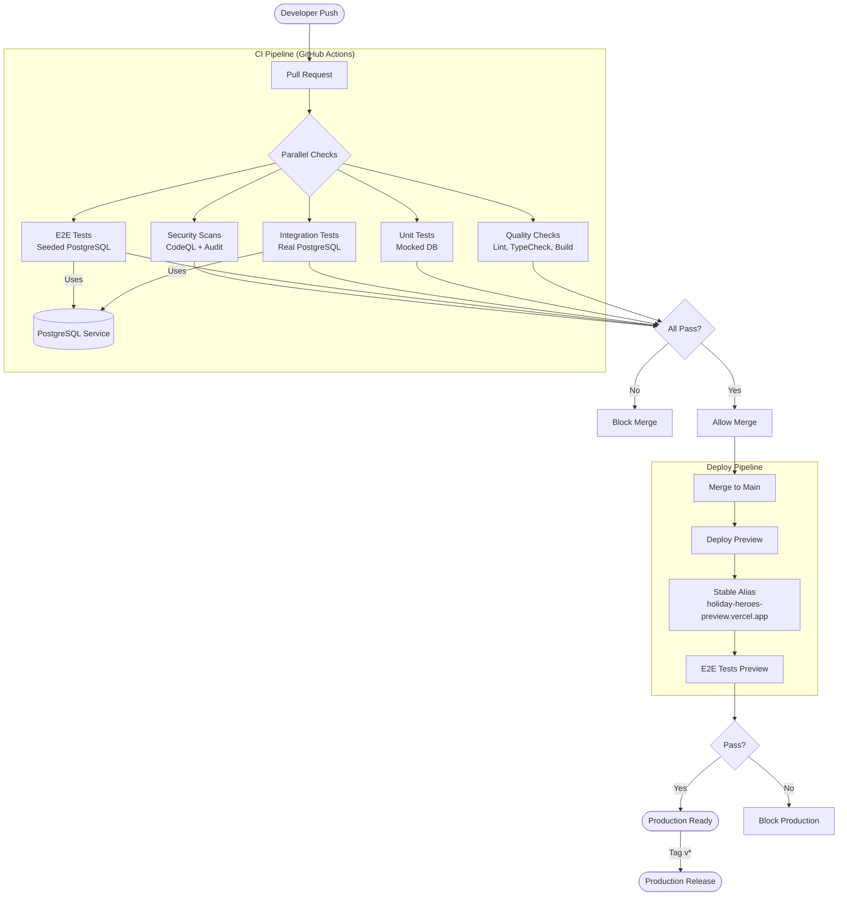

# CI/CD Shift-Left Strategy

This document outlines the Continuous Integration and Continuous Deployment (CI/CD) strategy for the Holiday Program Aggregator. We employ a "Shift Left" approach alongside a Stage-Gate model to ensure security and quality are verified early in the development lifecycle.

## Pipeline Overview

The pipeline enforces rigorous checks on every Pull Request (PR) before code can be merged to the `main` branch. This ensures that the `main` branch is always in a deployable state.

### Workflow Stages

1.  **Local Pre-commit (Husky)**:
    *   **Lint-Staged**: Runs `biome check` on changing files. Enforces quality before commit.
    *   **Commitlint**: Enforces semantic commit messages (e.g., `feat:`, `fix:`).
2.  **Commit & Push**: Developer pushes code to a feature branch.
3.  **Pull Request**: A PR is opened against `main`.
4.  **Automated Checks (Parallel)**:
    *   **Quality Checks**: Linting (Biome), TypeScript validation, and build verification.
    *   **Unit Tests**: Jest tests for isolated logic (mocked database).
    *   **Integration Tests**: Jest tests with real PostgreSQL for database operations and tRPC procedures.
    *   **E2E Tests**: Playwright tests run against a full instance of the app with a seeded Postgres database.
    *   **Security Scans**: CodeQL analysis and dependency audits.
5.  **Review**: Code review (including automated Claude AI review) must pass.
6.  **Merge**: Once all checks pass, code is merged to `main`.
7.  **Deploy & Verify**:
    *   Vercel deploys to preview with stable alias (`holiday-heroes-preview.vercel.app`)
    *   **E2E Tests (Preview)**: Playwright tests validate the deployed preview environment
8.  **Production**: Vercel automatically deploys `main` to Production (based on branch configuration).

## CI/CD Flow Diagram

## Environment Strategy

*   **Preview**: Deployed automatically for every PR with stable alias for OAuth testing.
*   **Staging**: The `main` branch acts as Staging. It is always deployable and reflects the latest integrated state.
*   **Production**: Deployed via release tags (e.g., `v*`). This ensures you only promote thoroughly tested code from `main`.

## Required Status Checks

The following checks must pass before merging to `main`:

| Check | Description |
|-------|-------------|
| **Quality Checks** | Linting, TypeScript validation, and build verification |
| **E2E Tests** | Playwright tests with seeded PostgreSQL database |
| **CodeQL Analysis** | Static code analysis for security vulnerabilities |
| **Integration Tests** | Jest tests with real PostgreSQL database |
| **E2E Tests (Preview)** | Playwright tests against deployed preview environment |
| **Security Scan Summary** | Dependency audit and secret scanning |

## Stable Preview Domain

For OAuth authentication (Google, etc.) to work on preview deployments, we use a stable alias:

- **Stable URL**: `https://holiday-heroes-preview.vercel.app`
- **Purpose**: Allows OAuth providers to have a consistent callback URL
- **Configuration**: Add this URL to OAuth provider's authorized redirect URIs

This alias is automatically applied to the latest preview deployment via the deploy workflow.

## Deployment Strategy Options

You asked for a **Trunk-Based** strategy. Here are the two best options. Both verify that **Ephemeral Preview URLs** (the "cool URLs") are available in **BOTH** strategies.

### Option 1: Continuous Deployment (Recommended for Speed)
In this model, "Staging" is effectively your Pull Request. You test the feature in the Preview URL *before* merging.
*   **Feature Branch (PR)**: Generates **Ephemeral Preview URL**. You test here.
*   **Merge**: Deploys immediately to **Production**.
*   **Pros**: Fast, simple, clean history.
*   **Cons**: `main` must always be stable.

### Option 2: Release Promotion (What you described)
In this model, `main` serves as a persistent "Staging" or "Beta" environment.
*   **Feature Branch (PR)**: Generates **Ephemeral Preview URL**.
*   **Merge**: Deploys to **Staging/Beta** (`main`). This is a persistent URL (e.g. `project-git-main.vercel.app`).
*   **Tag (e.g. `v1.0`)**: Promoting a specific commit from `main` to **Production** by creating a Release.
*   **Pros**: Safety gate before Production. Extra round of integration testing on `main`.
*   **Cons**: Slightly more process.

## Our Configuration (Option 2)

Based on your request ("deployment to staging on merge to main, production on sign-off"), we are configured for **Option 2**.

### 1. Ephemeral Previews (The "Cool URLs")
*   **Ref**: Pull Requests
*   **Dynamic URL**: `https://holiday-program-aggregator-git-feature-xyz.vercel.app`
*   **Stable Alias**: `https://holiday-heroes-preview.vercel.app` (for OAuth testing)
*   **Action**: Created automatically for every PR. Stable alias applied to latest preview.

### 2. Staging / Beta
*   **Ref**: `main` branch
*   **URL**: `https://holiday-program-aggregator-git-main.vercel.app`
*   **Action**: Updates automatically on every merge to `main`.
*   **Purpose**: Integration testing. Ensuring all features work together.

### 3. Production
*   **Ref**: Release Tags (`v*`)
*   **URL**: `https://holiday-program-aggregator.vercel.app`
*   **Action**: Triggered manually when you create a Release Tag.
    *   URL: `https://holiday-program-aggregator-git-feature-login-sdavidov17.vercel.app`
    *   Updates: Created automatically for every PR.
    *   **Ephemeral**: Unique to that specific branch/PR. Perfect for isolation.
