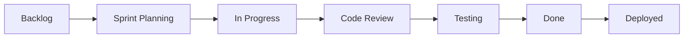

# Team Guidelines & Communication

## Team Structure

### Team Topologies Approach

Our team structure follows Team Topologies principles to optimize for fast flow of value delivery:

#### Four Fundamental Team Types

1. **Stream-Aligned Teams**: Aligned to a flow of work from a segment of the business domain
   - End-to-end ownership of features
   - Minimize handovers and dependencies
   - Direct customer value delivery

2. **Enabling Teams**: Help Stream-aligned teams overcome obstacles and detect missing capabilities
   - Temporary collaboration model
   - Knowledge transfer focus
   - Build capabilities, not dependencies

3. **Complicated Subsystem Teams**: Manage parts of the system that require specialist knowledge
   - Reduce cognitive load on stream-aligned teams
   - Deep expertise in specific technical areas

4. **Platform Teams**: Provide internal services to reduce cognitive load on stream-aligned teams
   - Self-service capabilities
   - API-first approach
   - Developer experience focus

#### Team Interaction Modes

- **Collaboration**: Working closely together for a limited time (discovery, innovation)
- **X-as-a-Service**: One team provides and one team consumes (clear boundaries)
- **Facilitating**: One team helps another to learn and improve capabilities

#### Cognitive Load Management

**Team Cognitive Load Assessment**:
- Domain complexity: How complex is the business domain?
- Technical complexity: How complex is the technology stack?
- Organizational complexity: How many teams/systems do we interact with?

**Reducing Cognitive Load**:
- Limit team responsibilities to what fits in their cognitive capacity
- Use platform teams to abstract infrastructure complexity
- Clear team boundaries and interfaces
- Minimize unnecessary team dependencies

### Roles & Responsibilities

| Role | Primary Owner | Backup | Responsibilities |
|------|--------------|--------|------------------|
| Product Manager | TBD | TBD | Product vision, roadmap, stakeholder management |
| Tech Lead | TBD | TBD | Architecture decisions, code reviews, technical mentorship |
| Scrum Master | TBD | TBD | Sprint planning, impediment removal, process improvement |
| Full Stack Dev | Team | Team | Feature development, testing, deployment |
| DevOps/SRE | TBD | TBD | Infrastructure, monitoring, incident response |
| UX Designer | TBD | TBD | User research, design systems, prototypes |

### RACI Matrix

| Activity | PM | TL | SM | Dev | UX |
|----------|----|----|----|----|----| 
| Sprint Planning | A | C | R | I | C |
| Story Writing | R | C | A | I | C |
| Code Review | I | A | I | R | I |
| Architecture Decisions | C | R | I | C | I |
| Release Planning | A | C | R | I | I |
| User Research | C | I | I | I | R |

*R=Responsible, A=Accountable, C=Consulted, I=Informed*

## Communication Channels

### Synchronous Communication

| Channel | Purpose | Response Time |
|---------|---------|---------------|
| Slack #dev | Development discussions | < 2 hours |
| Slack #urgent | Production issues | < 15 minutes |
| Slack #general | Team announcements | < 1 day |
| Video Calls | Complex discussions, pairing | Scheduled |

### Asynchronous Communication

| Channel | Purpose | Response Time |
|---------|---------|---------------|
| GitHub Issues | Feature requests, bugs | < 1 day |
| GitHub PRs | Code reviews | < 4 hours |
| Confluence | Documentation, decisions | N/A |
| Email | External communication | < 1 day |

## Meeting Cadence

### Regular Meetings

| Meeting | Frequency | Duration | Attendees | Purpose |
|---------|-----------|----------|-----------|---------|
| Daily Standup | Daily 9:30am | 15 min | All team | Progress, blockers |
| Sprint Planning | Bi-weekly Mon | 2 hours | All team | Plan sprint work |
| Sprint Retro | Bi-weekly Fri | 1 hour | All team | Continuous improvement |
| Backlog Grooming | Weekly Wed | 1 hour | PM, TL, SM | Story refinement |
| Tech Sync | Weekly Thu | 30 min | Devs, TL | Technical alignment |
| 1:1s | Bi-weekly | 30 min | Manager + IC | Career development |

### Meeting Guidelines

**DO ✅**
- Start and end on time
- Have clear agenda
- Share materials beforehand
- Take and share notes
- Define action items
- Record if needed

**DON'T ❌**
- Schedule during focus time
- Invite unnecessary attendees
- Skip without notice
- Multitask during meetings
- Leave without clear next steps

## Development Process

### Flow-Based Development

Aligned with Team Topologies principles for fast flow:

#### Flow Metrics
- **Flow Velocity**: Number of flow items completed per unit of time
- **Flow Time**: Time from start to completion of work
- **Flow Load**: Number of flow items in progress
- **Flow Efficiency**: Ratio of active time to wait time

#### Reducing Handovers
- Stream-aligned teams own features end-to-end
- Minimize coordination between teams
- Clear team APIs and boundaries
- Self-service platform capabilities

### Sprint Workflow



### Definition of Ready

Story is ready for development when ALL criteria are met.
See comprehensive DoR: [Definition of Ready](./definition-of-ready.md)

Key requirements:
- [ ] User story in proper format with clear value
- [ ] BDD scenarios defined (Given/When/Then)
- [ ] Three Amigos session completed (PM/BA + QA + Dev)
- [ ] Test strategy defined (Unit/Integration/E2E)
- [ ] Technical approach reviewed
- [ ] UI/UX designs approved (if applicable)

### Definition of Done

Story is complete when ALL criteria are met.
See comprehensive DoD: [Definition of Done](./definition-of-done.md)

Key requirements:
- [ ] All BDD scenarios implemented as tests
- [ ] 100% test pass rate achieved
- [ ] Code coverage >80% for new code
- [ ] Code reviewed and approved
- [ ] Performance benchmarks met
- [ ] Security scan passed
- [ ] Deployed to staging and tested
- [ ] Product Owner sign-off received

## Code Review Process

### Review Checklist

- [ ] Code follows style guide
- [ ] Tests are comprehensive
- [ ] No security vulnerabilities
- [ ] Performance considered
- [ ] Documentation updated
- [ ] No console.logs or debug code
- [ ] Error handling appropriate

### Review Guidelines

**Authors**:
- Keep PRs small (< 400 lines)
- Write descriptive PR description
- Link to related issue
- Respond to feedback promptly
- Don't take feedback personally

**Reviewers**:
- Review within 4 hours
- Be constructive and specific
- Suggest improvements
- Approve when satisfied
- Block only for critical issues

### PR Template

```markdown
## Description
Brief description of changes

## Type of Change
- [ ] Bug fix
- [ ] New feature
- [ ] Breaking change
- [ ] Documentation update

## Testing
- [ ] Unit tests pass
- [ ] Integration tests pass
- [ ] Manual testing completed

## Screenshots (if applicable)
[Add screenshots]

## Checklist
- [ ] Code follows style guide
- [ ] Self-review completed
- [ ] Documentation updated
- [ ] No new warnings
```

## Work-Life Balance

### Core Hours
- **Sydney**: 10:00 AM - 4:00 PM AEDT
- **Flexible**: Work any 8 hours with 4-hour overlap

### Focus Time
- **No Meeting Wednesday**: 2:00 PM - 5:00 PM
- **Deep Work Blocks**: Slack status "Focusing"

### Time Off
- Notify team 2 weeks in advance
- Update calendar and Slack status
- Ensure handover of critical tasks
- Emergency contact for urgent issues

## Incident Response

### Severity Levels

| Level | Definition | Response Time | Example |
|-------|-----------|---------------|---------|
| P0 | Complete outage | 15 min | Site down |
| P1 | Major feature broken | 1 hour | Search not working |
| P2 | Minor feature broken | 4 hours | Filter issue |
| P3 | Cosmetic issue | 1 day | UI alignment |

### Incident Process

1. **Detect**: Monitoring alert or user report
2. **Assess**: Determine severity and impact
3. **Communicate**: Post in #urgent channel
4. **Mitigate**: Apply quick fix if possible
5. **Resolve**: Fix root cause
6. **Review**: Post-mortem within 48 hours

### On-Call Rotation

- Weekly rotation (Mon-Sun)
- Primary and backup on-call
- Compensation for weekend incidents
- Handover meeting every Monday

## Knowledge Sharing

### Documentation
- Update docs with code changes
- Write ADRs for major decisions
- Document runbooks for operations
- Share learnings in team wiki

### Learning & Development
- 20% time for learning
- Conference attendance supported
- Internal tech talks monthly
- Pair programming encouraged

### Mentorship
- Each junior paired with senior
- Bi-weekly mentorship sessions
- Code review as teaching opportunity
- Safe space for questions

## Team Culture

### Core Values

1. **User First**: Every decision considers user impact
2. **Quality Matters**: We don't ship broken code
3. **Continuous Learning**: Always improving skills
4. **Collaboration**: Success is a team effort
5. **Work-Life Balance**: Sustainable pace

### Recognition

- Shout-outs in team meetings
- Quarterly MVP awards
- Peer bonus nominations
- Public praise for achievements

### Conflict Resolution

1. Direct conversation first
2. Involve manager if needed
3. Focus on facts, not emotions
4. Seek win-win solutions
5. Document agreements

## Remote Work Guidelines

### Equipment
- Company provides laptop
- $500 home office stipend
- Ergonomic assessment available
- High-speed internet reimbursement

### Communication
- Camera on for meetings (optional)
- Update Slack status regularly
- Over-communicate when remote
- Document decisions in writing

### Security
- Use VPN for sensitive work
- Lock screen when away
- Secure home network
- Follow security policies

## Onboarding Buddies

New team members paired with buddy for:
- First month check-ins
- Code walkthrough
- Process questions
- Social integration

## Feedback Culture

### Continuous Feedback
- Don't wait for 1:1s
- Be specific and timely
- Balance positive and constructive
- Focus on behaviors, not personality

### 360 Reviews
- Quarterly peer feedback
- Anonymous option available
- Manager synthesizes feedback
- Action plans created together

## Team Rituals

- **Monday**: Week kick-off
- **Wednesday**: Tech talk lunch
- **Friday**: Demo & celebrate wins
- **Monthly**: Team social event
- **Quarterly**: Offsite planning

## Emergency Contacts

```
Product Emergency: pm-oncall@team.com
Technical Emergency: tech-oncall@team.com
Security Incident: security@team.com
HR Urgent: hr@company.com
```

## Team Topologies Resources

### Core Learning Resources

#### Articles & Newsletters
- [Why Agile Isn't Enough - Part 1](https://teamtopologies.com/news-blogs-newsletters/why-agile-isnt-enough-and-whats-really-slowing-you-down-part-1) - Understanding organizational flow challenges and bottlenecks
- [Why Agile Isn't Enough - Part 2](https://teamtopologies.com/news-blogs-newsletters/why-agile-isnt-enough-and-whats-really-slowing-you-down-part-2) - Structural and interactional frictions that slow delivery

#### Training & Courses
- [Team Topologies Academy](https://academy.teamtopologies.com/) - Self-paced video courses
- [Team Topologies Distilled Course](https://academy.teamtopologies.com/courses) - 3-hour comprehensive overview
- [Team Topologies for Managers](https://academy.teamtopologies.com/courses/team-topologies-for-managers) - Leadership perspective
- [Effective Enabling Teams Course](https://academy.teamtopologies.com/courses) - Building capability-focused teams

#### Books & References
- [Team Topologies Book (2nd Edition)](https://teamtopologies.com/book) - Complete guide to organizing for fast flow
- [Key Concepts & Practices](https://teamtopologies.com/key-concepts) - Quick reference guide

### Implementation Guidance

#### Assessment Questions
1. Are we organized in a way that supports flow?
2. Can our teams deliver value independently?
3. How much effort goes to coordination vs. delivery?
4. What is our team's cognitive load?
5. Are team boundaries and interactions clear?

#### Anti-Patterns to Avoid
- Teams organized by function rather than value stream
- Excessive handovers between teams
- Unclear ownership and accountability
- Teams dependent on multiple other teams
- Cognitive overload from too many responsibilities

## Related Documents

- [Developer Onboarding](./developer-onboarding.md)
- [Testing Strategy](./testing-strategy.md)
- [Deployment Guide](./deployment-guide.md)
- [Project Roadmap](./project-roadmap.md)