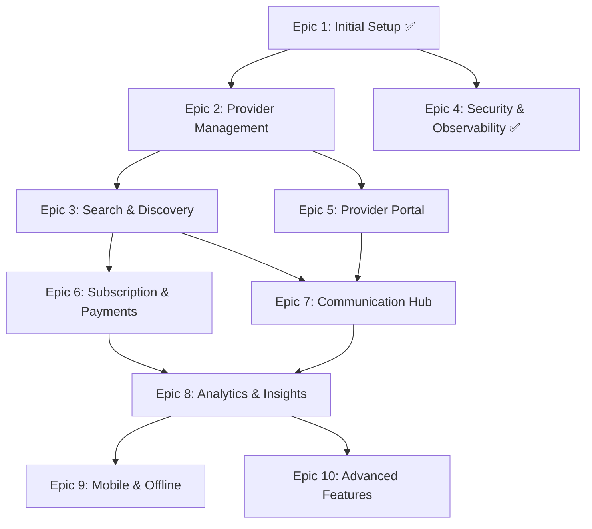

# Epic Dependencies & Implementation Roadmap

## Dependency Graph

## Implementation Phases

### Phase 1: Foundation (Weeks 1-2) ✅
- **Epic 1**: Initial Project Setup ✅
- **Epic 4**: Security, SRE & Observability ✅

### Phase 2: Core Admin (Weeks 3-6)
- **Epic 2**: Provider Management System
  - Depends on: Epic 1 ✅
  - Blocks: Epic 3, Epic 5

### Phase 3: User Experience (Weeks 7-10)
- **Epic 3**: Search & Discovery
  - Depends on: Epic 2
  - Blocks: Epic 6, Epic 7
  
### Phase 4: Provider Features (Weeks 11-14)
- **Epic 5**: Provider Portal
  - Depends on: Epic 2
  - Blocks: Epic 7

### Phase 5: Monetization (Weeks 15-18)
- **Epic 6**: Subscription & Payments
  - Depends on: Epic 3
  - Blocks: Epic 8

### Phase 6: Engagement (Weeks 19-22)
- **Epic 7**: Communication Hub
  - Depends on: Epic 3, Epic 5
  - Blocks: Epic 8

### Phase 7: Intelligence (Weeks 23-26)
- **Epic 8**: Analytics & Insights
  - Depends on: Epic 6, Epic 7
  - Blocks: Epic 9, Epic 10

### Phase 8: Expansion (Weeks 27-30)
- **Epic 9**: Mobile & Offline Support
  - Depends on: Epic 8
  
- **Epic 10**: Advanced Features
  - Depends on: Epic 8

## Critical Path

The critical path for MVP launch:
1. Epic 1 (Setup) ✅ → 
2. Epic 4 (Security) ✅ → 
3. Epic 2 (Provider Management) → 
4. Epic 3 (Search & Discovery) → 
5. Epic 6 (Payments)

## Epic Details

### Epic 1: Initial Project Setup ✅
**Status**: COMPLETED
**Stories**: 4 (all completed)
**Key Deliverables**: 
- Development environment
- CI/CD pipeline
- Database setup
- Deployment infrastructure

### Epic 2: Provider Management System
**Status**: Not Started
**Stories**: 5
**Estimated Duration**: 4 weeks
**Key Deliverables**:
- Provider CRUD operations
- Vetting workflow
- Bulk import/export
- Media management

### Epic 3: Search & Discovery
**Status**: Not Started
**Stories**: 6
**Estimated Duration**: 4 weeks
**Dependencies**: Requires Epic 2 completion
**Key Deliverables**:
- Geospatial search
- Advanced filters
- Saved searches
- Search analytics

### Epic 4: Security, SRE & Observability ✅
**Status**: COMPLETED (Free Tier)
**Stories**: 15 (12 original + 3 free tier additions)
**Key Deliverables**:
- Security headers & CSP
- Structured logging
- Health checks
- Vulnerability scanning
- Audit logging

### Epic 5: Provider Portal
**Status**: Not Started
**Stories**: 5
**Estimated Duration**: 4 weeks
**Dependencies**: Requires Epic 2 completion
**Key Deliverables**:
- Provider authentication
- Profile management
- Schedule management
- Booking management

### Epic 6: Subscription & Payments
**Status**: Not Started
**Stories**: 5
**Estimated Duration**: 3 weeks
**Dependencies**: Requires Epic 3 completion
**Key Deliverables**:
- Stripe integration
- Subscription tiers
- Payment processing
- Billing management

### Epic 7: Communication Hub
**Status**: Not Started
**Stories**: 4
**Estimated Duration**: 3 weeks
**Dependencies**: Requires Epic 3 & 5 completion
**Key Deliverables**:
- Messaging system
- Email notifications
- Booking confirmations
- Review system

### Epic 8: Analytics & Insights
**Status**: Not Started
**Stories**: 4
**Estimated Duration**: 3 weeks
**Dependencies**: Requires Epic 6 & 7 completion
**Key Deliverables**:
- Admin dashboard
- Provider analytics
- Revenue reports
- User behavior insights

### Epic 9: Mobile & Offline Support
**Status**: Not Started
**Stories**: 3
**Estimated Duration**: 3 weeks
**Dependencies**: Requires Epic 8 completion
**Key Deliverables**:
- PWA implementation
- Offline search
- Mobile optimizations

### Epic 10: Advanced Features
**Status**: Not Started
**Stories**: 4
**Estimated Duration**: 4 weeks
**Dependencies**: Requires Epic 8 completion
**Key Deliverables**:
- AI recommendations
- Social features
- Advanced integrations
- White-label support

## Risk Mitigation

### High-Risk Dependencies
1. **Payment Integration** (Epic 6): Critical for revenue
   - Mitigation: Early Stripe sandbox testing
   
2. **Geospatial Search** (Epic 3): Technical complexity
   - Mitigation: PostGIS setup in Epic 1 ✅

3. **Provider Vetting** (Epic 2): Compliance requirements
   - Mitigation: Early legal consultation

### Parallel Development Opportunities
- Epic 4 (Security) can progress alongside Epic 2
- Epic 5 (Provider Portal) UI can be designed during Epic 2
- Epic 7 (Communication) design can start during Epic 3

## Success Metrics

### Phase Completion Criteria
- **Phase 1**: Dev environment accessible, security headers working ✅
- **Phase 2**: Admin can CRUD providers
- **Phase 3**: Parents can search and find providers
- **Phase 4**: Providers can self-manage profiles
- **Phase 5**: Payments processing successfully
- **Phase 6**: Users communicating through platform
- **Phase 7**: Analytics dashboard populated
- **Phase 8**: Mobile app available