# Holiday Program Aggregator - Visual Story Map

## Story Map Overview

```mermaid
graph TB
    subgraph "Phase 1: Foundation ✅ COMPLETED"
        Epic1[Epic 1: Initial Setup]
        Epic1 --> Story1_1[Story 1.1: Repository Setup ✅]
        Epic1 --> Story1_2[Story 1.2: CI/CD ✅]
        Epic1 --> Story1_3[Story 1.3: Database ✅]
        Epic1 --> Story1_4[Story 1.4: Deployment ✅]
    end

    subgraph "Phase 2: Core Authentication & Admin"
        Epic2[Epic 2: Authentication]
        Epic2 --> Story2_1[Story 2.1: NextAuth Setup]
        Epic2 --> Story2_2[Story 2.2: User Registration]
        Epic2 --> Story2_3[Story 2.3: RBAC]
        
        Epic3[Epic 3: Admin Foundation]
        Epic3 --> Story3_1[Story 3.1: Admin Dashboard]
        Epic3 --> Story3_2[Story 3.2: User Management]
        Epic3 --> Story3_3[Story 3.3: System Config]
        
        Epic4A[Epic 4: Security Basics]
        Epic4A --> Story4_1[Story 4.1: Security Headers ✅]
        Epic4A --> Story4_2[Story 4.2: Logging ✅]
        Epic4A --> Story4_5[Story 4.5: Health Checks ✅]
    end

    subgraph "Phase 3: Provider & Content Management"
        EpicProv[Epic: Provider Management]
        EpicProv --> StoryP1[Story: Provider Registration]
        EpicProv --> StoryP2[Story: Provider Profile]
        EpicProv --> StoryP3[Story: Provider Verification]
        EpicProv --> StoryP4[Story: Admin Provider Mgmt]
        
        EpicCat[Epic: Program Catalog]
        EpicCat --> StoryCat1[Story: Program Listing]
        EpicCat --> StoryCat2[Story: Categories & Tags]
        EpicCat --> StoryCat3[Story: Program Details]
        EpicCat --> StoryCat4[Story: Geographic Data]
    end

    subgraph "Phase 4: User Experience & Search"
        EpicSearch[Epic: Search & Discovery]
        EpicSearch --> StoryS1[Story: Search Interface]
        EpicSearch --> StoryS2[Story: Search Results]
        EpicSearch --> StoryS3[Story: Map View]
        EpicSearch --> StoryS4[Story: Provider Details]
        EpicSearch --> StoryS5[Story: Advanced Filters]
        EpicSearch --> StoryS6[Story: Favorites]
    end

    subgraph "Phase 5: MVP Launch - Payments & Booking"
        EpicPay[Epic: Payments & Subscriptions]
        EpicPay --> StoryPay1[Story: Stripe Integration]
        EpicPay --> StoryPay2[Story: Subscription Tiers]
        EpicPay --> StoryPay3[Story: Payment Flow]
        EpicPay --> StoryPay4[Story: Billing Management]
        
        EpicBook[Epic: Booking System]
        EpicBook --> StoryBook1[Story: Availability Check]
        EpicBook --> StoryBook2[Story: Booking Flow]
    end

    subgraph "Phase 6: Growth Features"
        EpicPortal[Epic: Provider Portal]
        EpicPortal --> StoryPort1[Story: Provider Dashboard]
        EpicPortal --> StoryPort2[Story: Program Management]
        EpicPortal --> StoryPort3[Story: Revenue Dashboard]
        
        EpicComm[Epic: Communication]
        EpicComm --> StoryComm1[Story: Messaging System]
        EpicComm --> StoryComm2[Story: Email Notifications]
        EpicComm --> StoryComm3[Story: Reviews & Ratings]
        
        EpicSuggest[Epic: Proactive Suggestions]
        EpicSuggest --> StorySug1[Story: User Preferences]
        EpicSuggest --> StorySug2[Story: Email Generation]
        EpicSuggest --> StorySug3[Story: Scheduling]
    end

    subgraph "Phase 7: Scale & Optimize"
        EpicAnalytics[Epic: Analytics]
        EpicAnalytics --> StoryAn1[Story: Admin Analytics]
        EpicAnalytics --> StoryAn2[Story: Provider Metrics]
        
        EpicMobile[Epic: Mobile & PWA]
        EpicMobile --> StoryMob1[Story: PWA Implementation]
        EpicMobile --> StoryMob2[Story: Offline Support]
        
        EpicAdv[Epic: Advanced Features]
        EpicAdv --> StoryAdv1[Story: AI Recommendations]
        EpicAdv --> StoryAdv2[Story: Calendar Integration]
    end

    %% Dependencies
    Story1_1 -.-> Story2_1
    Story2_1 -.-> Story3_1
    Story2_3 -.-> StoryP1
    StoryP4 -.-> StoryCat1
    StoryCat4 -.-> StoryS1
    StoryS1 -.-> StoryPay1
    StoryPay1 -.-> StoryPort3
    Story2_2 -.-> StorySug1
```

## Milestone Timeline & Dependencies

### Phase 1: Foundation (Jan 2025) ✅
**Status**: COMPLETED
- Repository setup, CI/CD, Database, Deployment
- **Output**: Development environment ready

### Phase 2: Core Authentication & Admin (Feb 2025)
**Dependencies**: Phase 1
- User authentication system
- Admin dashboard framework
- Basic security implementation
- **Output**: Secure admin system with user management

### Phase 3: Provider & Content Management (Mar 2025)
**Dependencies**: Phase 2 (authentication & admin)
- Provider onboarding and verification
- Program catalog structure
- Content management system
- **Output**: Providers can be added, programs can be created

### Phase 4: User Experience & Search (Apr 2025)
**Dependencies**: Phase 3 (providers & programs exist)
- Search interface and filters
- Search results and map view
- Provider detail pages
- **Output**: Users can search and view programs

### Phase 5: MVP Launch - Payments & Booking (May 2025)
**Dependencies**: Phase 4 (users can find programs)
- Payment processing (Stripe)
- Subscription management
- Basic booking flow
- **Output**: Complete MVP - users can subscribe, search, and book

### Phase 6: Growth Features (Jun 2025)
**Dependencies**: Phase 5 (core MVP complete)
- Provider self-service portal
- Communication system
- Proactive suggestions
- **Output**: Enhanced user and provider experience

### Phase 7: Scale & Optimize (Jul 2025)
**Dependencies**: Phase 6 (full feature set)
- Analytics and reporting
- Mobile optimization (PWA)
- AI and advanced features
- **Output**: Optimized, data-driven platform

## Critical Path

## Key Insights

### 1. Dependency Flow
- Each phase builds on the previous one
- No phase can start without its dependencies
- Critical path is clear: Auth → Providers → Programs → Search → Payments

### 2. MVP Definition
- True MVP is achieved at end of Phase 5
- Includes: User auth, provider catalog, search, and payments
- Everything after Phase 5 is growth/optimization

### 3. Risk Areas
- Phase 3-4 transition: Ensuring enough content for search
- Phase 4-5 transition: Payment integration complexity
- Phase 6: Provider adoption of self-service tools

### 4. Parallel Work Opportunities
- Within Phase 2: Auth and Admin can progress in parallel
- Within Phase 3: Provider management and catalog structure
- Within Phase 6: Portal, communications, and suggestions
- Within Phase 7: Analytics, mobile, and AI features

## Recommended Adjustments

### 1. Create Missing Issues
- Security, SRE & Observability stories (currently missing)
- Proactive suggestions epic and stories
- Booking system stories for MVP

### 2. Reassign Issues to Correct Milestones
- Move provider portal stories from Phase 5 to Phase 6
- Move core search features to Phase 4
- Ensure payment system is in Phase 5 for MVP

### 3. Update Epic Numbers
- Clarify Epic 6 duplication (catalog vs payments)
- Properly number and organize all epics
- Ensure consistent epic references across documents