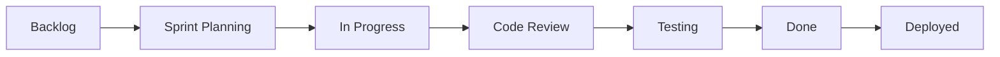

# Team Guidelines & Communication

## Team Structure

### Roles & Responsibilities

| Role | Primary Owner | Backup | Responsibilities |
|------|--------------|--------|------------------|
| Product Manager | TBD | TBD | Product vision, roadmap, stakeholder management |
| Tech Lead | TBD | TBD | Architecture decisions, code reviews, technical mentorship |
| Scrum Master | TBD | TBD | Sprint planning, impediment removal, process improvement |
| Full Stack Dev | Team | Team | Feature development, testing, deployment |
| DevOps/SRE | TBD | TBD | Infrastructure, monitoring, incident response |
| UX Designer | TBD | TBD | User research, design systems, prototypes |

### RACI Matrix

| Activity | PM | TL | SM | Dev | UX |
|----------|----|----|----|----|----| 
| Sprint Planning | A | C | R | I | C |
| Story Writing | R | C | A | I | C |
| Code Review | I | A | I | R | I |
| Architecture Decisions | C | R | I | C | I |
| Release Planning | A | C | R | I | I |
| User Research | C | I | I | I | R |

*R=Responsible, A=Accountable, C=Consulted, I=Informed*

## Communication Channels

### Synchronous Communication

| Channel | Purpose | Response Time |
|---------|---------|---------------|
| Slack #dev | Development discussions | < 2 hours |
| Slack #urgent | Production issues | < 15 minutes |
| Slack #general | Team announcements | < 1 day |
| Video Calls | Complex discussions, pairing | Scheduled |

### Asynchronous Communication

| Channel | Purpose | Response Time |
|---------|---------|---------------|
| GitHub Issues | Feature requests, bugs | < 1 day |
| GitHub PRs | Code reviews | < 4 hours |
| Confluence | Documentation, decisions | N/A |
| Email | External communication | < 1 day |

## Meeting Cadence

### Regular Meetings

| Meeting | Frequency | Duration | Attendees | Purpose |
|---------|-----------|----------|-----------|---------|
| Daily Standup | Daily 9:30am | 15 min | All team | Progress, blockers |
| Sprint Planning | Bi-weekly Mon | 2 hours | All team | Plan sprint work |
| Sprint Retro | Bi-weekly Fri | 1 hour | All team | Continuous improvement |
| Backlog Grooming | Weekly Wed | 1 hour | PM, TL, SM | Story refinement |
| Tech Sync | Weekly Thu | 30 min | Devs, TL | Technical alignment |
| 1:1s | Bi-weekly | 30 min | Manager + IC | Career development |

### Meeting Guidelines

**DO ✅**
- Start and end on time
- Have clear agenda
- Share materials beforehand
- Take and share notes
- Define action items
- Record if needed

**DON'T ❌**
- Schedule during focus time
- Invite unnecessary attendees
- Skip without notice
- Multitask during meetings
- Leave without clear next steps

## Development Process

### Sprint Workflow



### Definition of Ready

Story is ready for development when:
- [ ] Acceptance criteria defined
- [ ] UI/UX designs completed (if applicable)
- [ ] Technical approach discussed
- [ ] Dependencies identified
- [ ] Estimated by team
- [ ] Test scenarios documented

### Definition of Done

Story is complete when:
- [ ] Code complete and pushed
- [ ] Unit tests written and passing
- [ ] Integration tests passing
- [ ] Code reviewed and approved
- [ ] Documentation updated
- [ ] Deployed to staging
- [ ] QA tested and approved
- [ ] Merged to main branch

## Code Review Process

### Review Checklist

- [ ] Code follows style guide
- [ ] Tests are comprehensive
- [ ] No security vulnerabilities
- [ ] Performance considered
- [ ] Documentation updated
- [ ] No console.logs or debug code
- [ ] Error handling appropriate

### Review Guidelines

**Authors**:
- Keep PRs small (< 400 lines)
- Write descriptive PR description
- Link to related issue
- Respond to feedback promptly
- Don't take feedback personally

**Reviewers**:
- Review within 4 hours
- Be constructive and specific
- Suggest improvements
- Approve when satisfied
- Block only for critical issues

### PR Template

```markdown
## Description
Brief description of changes

## Type of Change
- [ ] Bug fix
- [ ] New feature
- [ ] Breaking change
- [ ] Documentation update

## Testing
- [ ] Unit tests pass
- [ ] Integration tests pass
- [ ] Manual testing completed

## Screenshots (if applicable)
[Add screenshots]

## Checklist
- [ ] Code follows style guide
- [ ] Self-review completed
- [ ] Documentation updated
- [ ] No new warnings
```

## Work-Life Balance

### Core Hours
- **Sydney**: 10:00 AM - 4:00 PM AEDT
- **Flexible**: Work any 8 hours with 4-hour overlap

### Focus Time
- **No Meeting Wednesday**: 2:00 PM - 5:00 PM
- **Deep Work Blocks**: Slack status "Focusing"

### Time Off
- Notify team 2 weeks in advance
- Update calendar and Slack status
- Ensure handover of critical tasks
- Emergency contact for urgent issues

## Incident Response

### Severity Levels

| Level | Definition | Response Time | Example |
|-------|-----------|---------------|---------|
| P0 | Complete outage | 15 min | Site down |
| P1 | Major feature broken | 1 hour | Search not working |
| P2 | Minor feature broken | 4 hours | Filter issue |
| P3 | Cosmetic issue | 1 day | UI alignment |

### Incident Process

1. **Detect**: Monitoring alert or user report
2. **Assess**: Determine severity and impact
3. **Communicate**: Post in #urgent channel
4. **Mitigate**: Apply quick fix if possible
5. **Resolve**: Fix root cause
6. **Review**: Post-mortem within 48 hours

### On-Call Rotation

- Weekly rotation (Mon-Sun)
- Primary and backup on-call
- Compensation for weekend incidents
- Handover meeting every Monday

## Knowledge Sharing

### Documentation
- Update docs with code changes
- Write ADRs for major decisions
- Document runbooks for operations
- Share learnings in team wiki

### Learning & Development
- 20% time for learning
- Conference attendance supported
- Internal tech talks monthly
- Pair programming encouraged

### Mentorship
- Each junior paired with senior
- Bi-weekly mentorship sessions
- Code review as teaching opportunity
- Safe space for questions

## Team Culture

### Core Values

1. **User First**: Every decision considers user impact
2. **Quality Matters**: We don't ship broken code
3. **Continuous Learning**: Always improving skills
4. **Collaboration**: Success is a team effort
5. **Work-Life Balance**: Sustainable pace

### Recognition

- Shout-outs in team meetings
- Quarterly MVP awards
- Peer bonus nominations
- Public praise for achievements

### Conflict Resolution

1. Direct conversation first
2. Involve manager if needed
3. Focus on facts, not emotions
4. Seek win-win solutions
5. Document agreements

## Remote Work Guidelines

### Equipment
- Company provides laptop
- $500 home office stipend
- Ergonomic assessment available
- High-speed internet reimbursement

### Communication
- Camera on for meetings (optional)
- Update Slack status regularly
- Over-communicate when remote
- Document decisions in writing

### Security
- Use VPN for sensitive work
- Lock screen when away
- Secure home network
- Follow security policies

## Onboarding Buddies

New team members paired with buddy for:
- First month check-ins
- Code walkthrough
- Process questions
- Social integration

## Feedback Culture

### Continuous Feedback
- Don't wait for 1:1s
- Be specific and timely
- Balance positive and constructive
- Focus on behaviors, not personality

### 360 Reviews
- Quarterly peer feedback
- Anonymous option available
- Manager synthesizes feedback
- Action plans created together

## Team Rituals

- **Monday**: Week kick-off
- **Wednesday**: Tech talk lunch
- **Friday**: Demo & celebrate wins
- **Monthly**: Team social event
- **Quarterly**: Offsite planning

## Emergency Contacts

```
Product Emergency: pm-oncall@team.com
Technical Emergency: tech-oncall@team.com
Security Incident: security@team.com
HR Urgent: hr@company.com
```

## Related Documents

- [Developer Onboarding](./developer-onboarding.md)
- [Testing Strategy](./testing-strategy.md)
- [Deployment Guide](./deployment-guide.md)
- [Project Roadmap](./project-roadmap.md)